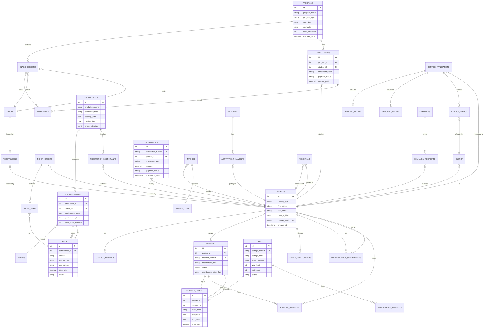

# Bay View Association Database Entity Relationship Diagram

## Overview
This document provides a visual representation of the comprehensive database design for Bay View Association, showing how all entities relate to each other in a unified system.



## Key Relationship Patterns

### 1. Hub-and-Spoke: Person-Centric Design
The `PERSONS` table is the central hub, with all other entities ultimately connecting back to a person:
- Members, staff, guests, artists, instructors all exist in PERSONS
- Every transaction, enrollment, ticket purchase, etc. links to a person
- Enables 360-degree view of any individual's relationship with Bay View

### 2. Polymorphic Relationships
Several tables use polymorphic patterns to link to multiple entity types:
- `TRANSACTIONS` uses `reference_type` and `reference_id` to link to various sources
- `AUDIT_LOG` can track changes to any table
- Provides flexibility while maintaining referential integrity where possible

### 3. Many-to-Many Relationships
Junction tables handle complex relationships:
- `FAMILY_RELATIONSHIPS` - bidirectional family connections
- `SERVICE_CLERGY` - multiple clergy per service
- `PRODUCTION_PARTICIPANTS` - many people in many roles per production

### 4. Temporal Relationships
Time-based data with validity periods:
- `COTTAGE_LEASES` - historical and current leases
- `ENROLLMENTS` - status changes over time
- `MEMBERSHIP` - active periods and renewals

### 5. Hierarchical Relationships
- Family generations tracked through `generation_number`
- Nested cottage ownership (owner → leaseholder → sublease)
- Organization hierarchy (board → committees → volunteers)

## Data Flow Examples

### Member Lifecycle
```
PERSON created → MEMBER record added → COTTAGE_LEASE assigned → 
ENROLLMENTS in programs → TICKET_ORDERS for events → 
TRANSACTIONS for all payments → ACCOUNT_BALANCES updated
```

### Event Flow
```
PRODUCTION created → PERFORMANCES scheduled → TICKETS generated →
TICKET_ORDERS placed → ORDER_ITEMS created → TRANSACTIONS recorded →
ATTENDANCE tracked → REVIEWS collected
```

### Education Journey
```
PROGRAM announced → ENROLLMENTS open → STUDENTS register →
CLASS_SESSIONS scheduled → ATTENDANCE tracked → GRADES assigned →
CERTIFICATES issued → ALUMNI status
```

## Referential Integrity Rules

1. **CASCADE DELETE**: 
   - Deleting a PERSON cascades to contact methods, preferences
   - Deleting a PRODUCTION cascades to performances, participants

2. **RESTRICT DELETE**:
   - Cannot delete a PERSON with financial transactions
   - Cannot delete a COTTAGE with active leases

3. **SET NULL**:
   - Deleting an instructor sets class session instructor_id to NULL
   - Allows historical records to remain valid

4. **UNIQUE CONSTRAINTS**:
   - One active lease per cottage
   - One primary contact method per type per person
   - No double-booking of facilities

## Performance Optimization

### Indexing Strategy
```sql
-- Frequently joined columns
CREATE INDEX idx_fk_indexes ON all_tables(foreign_key_columns);

-- Search optimization
CREATE INDEX idx_fulltext_search ON persons USING GIN(full_name_search);

-- Date range queries
CREATE INDEX idx_date_ranges ON events(start_date, end_date);

-- Status filtering
CREATE INDEX idx_status_filters ON members(status) WHERE status = 'active';
```

### Materialized Views for Analytics
```sql
-- Pre-calculate complex joins
CREATE MATERIALIZED VIEW member_engagement_summary AS
SELECT /* complex aggregation query */
WITH DATA;

-- Refresh periodically
REFRESH MATERIALIZED VIEW CONCURRENTLY member_engagement_summary;
```

### Partitioning Large Tables
```sql
-- Partition transactions by year
CREATE TABLE transactions_2024 PARTITION OF transactions
FOR VALUES FROM ('2024-01-01') TO ('2025-01-01');

-- Partition audit logs by month
CREATE TABLE audit_log_2024_01 PARTITION OF audit_log
FOR VALUES FROM ('2024-01-01') TO ('2024-02-01');
```

## Scalability Considerations

1. **Horizontal Scaling**:
   - Read replicas for reporting
   - Separate OLAP database for analytics
   - Caching layer for frequently accessed data

2. **Vertical Scaling**:
   - Partitioning strategy for large tables
   - Archive historical data to cold storage
   - Compress audit logs and old transactions

3. **Microservices Ready**:
   - Each major domain (education, events, property) could become separate service
   - Shared person service as central authority
   - Event sourcing for cross-service synchronization

This design demonstrates the power of a properly normalized relational database with well-defined relationships, constraints, and optimization strategies - capabilities that cannot be replicated in a flat system like Notion.