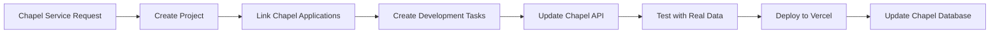
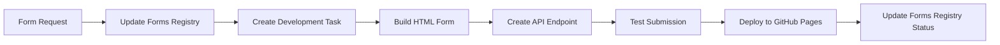
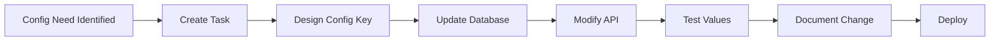

# Bay View Notion Integration Guide

## Overview
This guide explains how to integrate the Bay View project management framework with the existing Bay View Notion databases and the unified system backend.

## Existing Bay View Databases

### 1. Bay View Chapel Services
- **ID**: 89b34717-a72a-4f8d-8eb7-79d5cc6d9412
- **Purpose**: Track chapel service applications
- **Integration**: Link to Tasks for chapel-related development

### 2. Bay View Memorial Garden Applications  
- **ID**: e438c3bd-041a-4977-baac-de59ea4cc1e7
- **Purpose**: Manage memorial garden applications
- **Integration**: Link to Tasks for memorial system work

### 3. Bay View Forms Registry
- **ID**: 9b4f7dce-9527-4baa-a5a6-1635d525ac0d
- **Purpose**: Catalog of all 48 Bay View forms
- **Integration**: Track form development tasks

### 4. Bay View Members
- **ID**: ffb1d2acf99a481a933cb5d533261445
- **Purpose**: Member database
- **Integration**: Reference for member-related features

### 5. Bay View Facilities
- **ID**: 594c8a3a-ea75-40eb/afff-1a097f5dda94
- **Purpose**: Facility information with JSON schemas
- **Integration**: Track facility booking system development

## Integration Points

### 1. Cross-Database Relations
Set up these relations after creating the project management databases:

```javascript
// In Bay View Development Tasks
"Related Chapel Application": { 
  type: "relation", 
  database: "Bay View Chapel Services" 
}
"Related Memorial Application": { 
  type: "relation", 
  database: "Bay View Memorial Garden Applications" 
}
"Related Form": { 
  type: "relation", 
  database: "Bay View Forms Registry" 
}

// In Bay View Projects
"Affected Forms": { 
  type: "relation", 
  database: "Bay View Forms Registry" 
}
"Related Members": { 
  type: "relation", 
  database: "Bay View Members" 
}
```

### 2. Unified Views
Create these cross-database views:

#### System Health Dashboard
- Projects by component (Chapel, Memorial, etc.)
- Active tasks grouped by system
- Blockers affecting each subsystem
- Form development status

#### Data Migration Tracker
- Legacy system status
- Migration task progress
- Data validation results
- Dual-write verification

#### API Development Board
- All API endpoints across systems
- Testing status
- Documentation completeness
- Performance metrics

## Workflow Integration

### 1. Chapel Service Development Flow


### 2. Form Development Flow


### 3. Configuration Change Flow


## Automation Recipes

### 1. When Chapel Application Created
- If status = "Requires Development"
- Then create Task in Development Tasks
- Link to Chapel Application
- Assign to API team

### 2. When Form Updated
- If GitHub URL changes
- Then create deployment task
- Update Forms Registry
- Notify form users

### 3. When Blocker Resolved
- Update all linked tasks
- Notify assignees
- Log resolution time
- Update project health

## API Integration

### 1. Sync Task Status with GitHub
```javascript
// Webhook endpoint for GitHub
app.post('/api/webhooks/github', async (req, res) => {
  const { issue, action } = req.body;
  
  if (action === 'closed') {
    // Update Notion task status to "Done"
    await updateNotionTask(issue.number, { status: "Done" });
  }
});
```

### 2. Update Project Progress
```javascript
// Calculate and update project progress
async function updateProjectProgress(projectId) {
  const tasks = await getProjectTasks(projectId);
  const completedTasks = tasks.filter(t => t.status === "Done");
  const progress = (completedTasks.length / tasks.length) * 100;
  
  await updateNotionProject(projectId, { progress });
}
```

### 3. Create Tasks from Forms
```javascript
// Auto-create tasks for new forms
async function createFormTask(formData) {
  const task = {
    name: `Implement ${formData.formName}`,
    type: "Feature",
    component: ["Forms"],
    relatedForm: formData.id,
    acceptanceCriteria: `
      - HTML form created
      - API endpoint working
      - Data saved to database
      - Notion integration complete
    `
  };
  
  return await createNotionTask(task);
}
```

## Reporting Integration

### 1. Weekly Status Report
Combines data from all databases:
- Active projects and their health
- Tasks completed this week
- Active blockers
- Upcoming milestones
- Form submission statistics

### 2. Migration Progress Report
- Legacy vs modern system usage
- Dual-write success rate
- Data integrity checks
- Performance comparisons

### 3. System Performance Dashboard
- API response times
- Database query performance
- Error rates by component
- User adoption metrics

## Best Practices

### 1. Linking Strategy
- Always link tasks to relevant applications
- Use consistent naming between systems
- Keep relationships bidirectional
- Document integration points

### 2. Data Consistency
- Use same status values across databases
- Synchronize date formats
- Maintain referential integrity
- Regular data audits

### 3. Permission Management
- Project team sees all databases
- Directors see their component
- Stakeholders see dashboards only
- External users see nothing

## Troubleshooting

### Common Issues

1. **Relation Not Working**
   - Check database permissions
   - Verify property types match
   - Ensure bidirectional setup

2. **View Not Updating**
   - Check filter conditions
   - Verify property names
   - Clear cache and refresh

3. **Automation Failing**
   - Check trigger conditions
   - Verify action permissions
   - Review error logs

### Integration Testing

1. **Create Test Project**
   - Link to all systems
   - Create sample tasks
   - Test all workflows

2. **Verify Data Flow**
   - Task → Application linking
   - Status synchronization
   - Progress calculations

3. **Performance Check**
   - Load test with many tasks
   - Check view rendering speed
   - Monitor API limits

## Future Enhancements

### Phase 3 Integration
- Analytics dashboard
- Financial reporting
- Volunteer tracking
- Document management

### Mobile Integration
- Notion mobile app setup
- Custom notifications
- Offline capability
- Quick actions

### AI Assistance
- Smart task creation
- Priority suggestions
- Blocker prediction
- Progress forecasting

This integration ensures the project management system works seamlessly with Bay View's existing Notion infrastructure while supporting the unified system development.